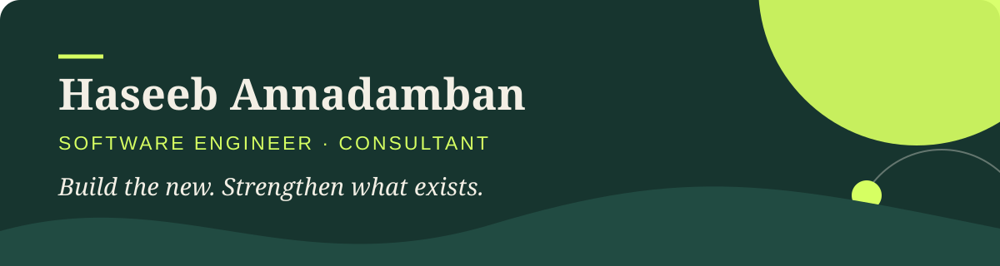

I help teams improve **established Rails applications**. and **automate practical workflows with AI**

# Services

<table>
<tr>
<td width="50%" valign="top">

### ⚡ [Rails performance sprint](https://haseebeqx.com/services/rails-performance-sprint/)

Find the real bottlenecks in a Rails and PostgreSQL application, then turn the diagnosis into measurable improvements.

</td>
<td width="50%" valign="top">

### 🛠️ [Rails consulting](https://haseebeqx.com/services/rails-consulting/)

Modernize legacy applications, improve architecture, build integrations, stabilize background jobs, or add senior delivery capacity.

</td>
</tr>
<tr>
<td width="50%" valign="top">

### ✦ [Rails + AI](https://haseebeqx.com/services/rails-ai/)

Add a useful AI-assisted feature to an existing Rails product—connected to its current data, permissions, jobs, and business logic.

</td>
<td width="50%" valign="top">

### 🤖 [AI workflows](https://haseebeqx.com/services/ai-workflows/)

Turn a repeatable research or operational process into a focused workflow with structured outputs, validation, and human approval.

</td>
</tr>
</table>

> **Not sure which path fits?** [Describe the business problem](https://haseebeqx.com/contact-me/). I'll recommend the smallest sensible engagement—even when that means not using AI.

## Open-source work

| Project | What it does | Focus |
|---|---|---|
| [**reddit-pain-research-skill**](https://github.com/haseebeqx/reddit-pain-research-skill) | A reusable customer-research method with sourced evidence, structured artifacts, validation, and an approval checkpoint. | Skills · Research · Validation |
| [**pi-runbooks**](https://github.com/haseebeqx/pi-runbooks) | Turns repeatable agent work into versioned runbooks with approval gates, checkpoints, and output verification. | TypeScript · Agent workflows |
| [**pi-agent-lib**](https://github.com/haseebeqx/pi-agent-lib) | Wraps the Pi SDK with consistent agent isolation, lifecycle management, resource discovery, and multi-agent runtime conventions. | TypeScript · Pi SDK · Agents |
| [**pi-ship**](https://github.com/haseebeqx/pi-ship) | Deploys Pi to SSH-accessible Linux servers for terminal, Telegram, or Slack access. | TypeScript · Linux · Deployment |

## Tools I work with

---

### Contact

[**Let's discuss the work →**](https://haseebeqx.com/contact-me/)

